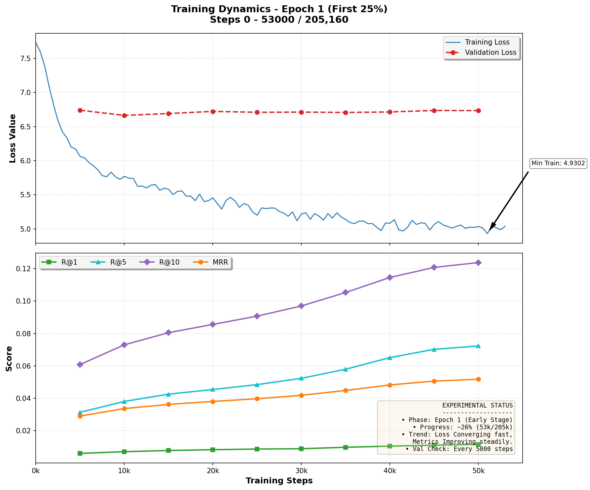

# 🎵 Music Recommendation System (Two-Tower & DCN-v2)



Dự án xây dựng hệ thống gợi ý âm nhạc quy mô lớn (Large-scale Recommender System) sử dụng kiến trúc **Two-Tower** cho giai đoạn Retrieval và **Deep & Cross Network (DCN-v2)** cho giai đoạn Ranking.

## 🚀 Kiến trúc Hệ thống

Hệ thống được thiết kế với các module tách biệt:

1.  **Data Pipeline (`src/data`)**:
    -   Sử dụng **Polars** để xử lý dữ liệu lớn (Parquet) với tốc độ cao.
    -   **Memory Mapping (`mmap`)** giúp load hàng triệu item mà không tốn RAM.
    -   **Zero-copy** data loading trong PyTorch DataLoader.

2.  **Model (`src/model`)**:
    -   **Two-Tower (Dual Encoder)**: Học biểu diễn User và Item trong cùng không gian vector.
    -   **Weight Sharing**: Chia sẻ Embedding giữa 2 tháp để tiết kiệm VRAM.
    -   **DCN-v2**: Mô hình Ranking học tương tác feature bậc cao.

3.  **Training (`src/training`)**:
    -   Hỗ trợ **Mixed Precision (AMP)** và **Gradient Accumulation**.
    -   Cơ chế **Checkpoint Rotation** thông minh.
    -   Validation loop tối ưu bộ nhớ.

4.  **Inference (`src/inference`)**:
    -   Sử dụng **FAISS** để tìm kiếm vector tương đồng (Similarity Search) với tốc độ mili-giây.

## 📂 Cấu trúc Thư mục

```
src/
├── config.py           # Cấu hình toàn cục (Paths, Hyperparams)
├── main.py             # Entry point chính
├── Makefile            # Các lệnh automation
├── requirements.txt    # Các thư viện cần thiết
├── data/               # Module xử lý dữ liệu
│   ├── download.py     # Tải dữ liệu từ HuggingFace
│   ├── preprocess.py   # Làm sạch & tạo static features
│   └── dataset.py      # PyTorch Dataset & MetadataStore
├── model/              # Định nghĩa Model
│   ├── layers.py       # Các layer cơ bản (PositionalEncoding, Attention)
│   ├── towers.py       # UserTower & ItemTower
│   ├── two_tower.py    # TwoTowerModel wrapper
│   ├── ranking.py      # DCN-v2 Ranking Model
│   └── loss.py         # InfoNCE & Ranking Loss
├── training/           # Training Loop
│   ├── trainer.py      # TwoTowerTrainer
│   └── callbacks.py    # CheckpointManager
├── inference/          # Inference Logic
│   ├── index.py        # Sinh vector & tạo FAISS index
│   └── retrieve.py     # Test retrieval
└── utils/              # Tiện ích bổ trợ
    ├── common.py       # Memory profiling
    └── scheduling.py   # LR Scheduler
```

## 🛠️ Cài đặt & Sử dụng

### 1. Môi trường
Yêu cầu Python 3.8+ và CUDA (nếu dùng GPU).

```bash
# Cài đặt thư viện
make setup
# Hoặc: pip install -r requirements.txt
```

### 2. Chuẩn bị Dữ liệu
Hệ thống sẽ tải dữ liệu mẫu từ Yandex Music (Yambda dataset).

```bash
# Tải dữ liệu thô
make download

# Xử lý & Tạo features (Mất khoảng vài phút tùy CPU)
make preprocess
```

### 3. Huấn luyện (Training)
Bắt đầu quá trình huấn luyện Two-Tower Model.

```bash
make train
```

Sau khi train xong, model sẽ tự động:
1.  Lưu checkpoint vào `data/checkpoints/`.
2.  Sinh vector cho toàn bộ Item.
3.  Tạo FAISS Index (`item_vectors.faiss`).
4.  Chạy thử nghiệm truy xuất (Retrieval Test) cho một User ngẫu nhiên.

## 📝 Ghi chú
-   **Cấu hình**: Có thể thay đổi Hyperparameters trong `src/config.py`.
-   **Dữ liệu**: Mặc định dữ liệu sẽ được lưu tại thư mục `data/` trong cùng thư mục với `src`. Đảm bảo bạn có đủ dung lượng ổ cứng (~2-3GB cho bản demo).
